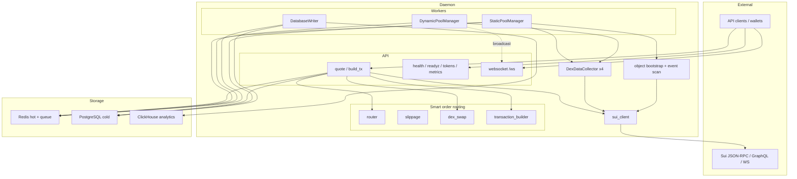
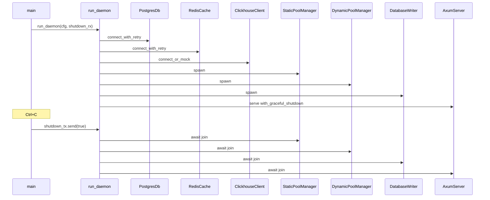
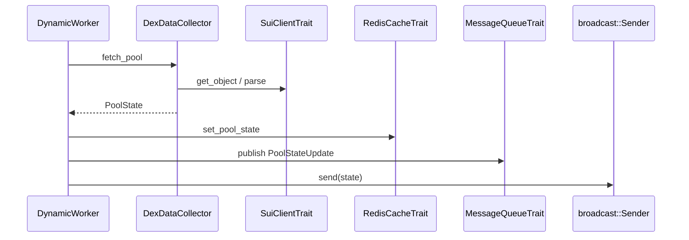
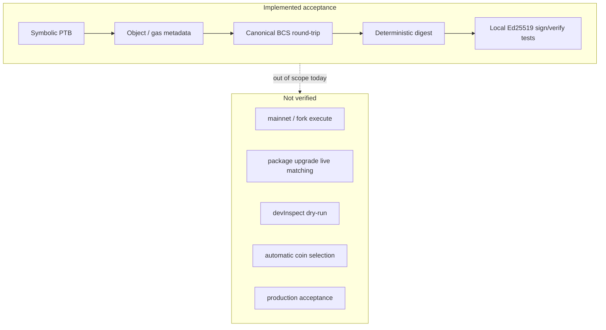

# Architecture

DevilRay runs as a single long-lived daemon: Axum HTTP/WebSocket API, background workers, and Sui clients share one process. Storage is split into three paths.

| Path | Technology | Role |
| --- | --- | --- |
| **Hot** | Redis | Live `PoolState`, topology snapshots, tick cache, list queue, gas price |
| **Cold** | PostgreSQL | Tokens, pools, tick tables, discovery progress, system config |
| **Analytics** | ClickHouse (optional) | `swap_events` MergeTree |

## Component overview

## Daemon lifecycle

## Dynamic worker invariant

Per pool update task, order is fixed:

Do not reorder these steps.

## Discovery

`StaticPoolManager` treats **object bootstrap** (`objects(filter: { type })`) as authoritative topology. Event scanning is incremental acceleration only; retention gaps report `retention_limited` without wiping topology.

Pages commit atomically to PostgreSQL (pools + tokens + progress + failures), then refresh Redis topology caches and enqueue persistence messages.

## Smart order routing

- Build `TokenGraph` from active pools (paused pools excluded).
- Small amounts → Dijkstra (fee + hop cost).
- Large amounts → hop-limited DFS, then `optimize_order_split` with gas-aware pruning.
- Simulation prefers tick-aware CLMM math when `PoolTickData` exists; otherwise within-tick fallback.
- Slippage uses basis points and `u128` amount math.

## Transaction building

Two layers:

1. **Symbolic PTB** — `dex_swap` emits `PtbCommand` chains (flash-swap patterns for Magma/Momentum; router-style for Turbos; Cetus flash pattern).
2. **Canonical builder** — `transaction_builder` resolves object/gas metadata into `sui_sdk_types::Transaction` BCS + digest.

`InMemorySuiClient` deliberately refuses `execute_transaction_block`.

## Queue messages

| `QueueMessage` | Persistence target |
| --- | --- |
| `PoolStateUpdate` | PostgreSQL pools |
| `PoolTickDataUpdate` | PostgreSQL tick tables |
| `SwapEventLog` | ClickHouse `swap_events` |

Terminal write failures go to a Redis DLQ after retries; operators can replay with `replay_dlq`.

## Key source files

| Area | Paths |
| --- | --- |
| Entry | `src/main.rs`, `src/daemon.rs` |
| API | `src/api/*` |
| Routing | `src/router.rs`, `src/slippage.rs` |
| PTB | `src/dex_swap.rs`, `src/transaction_builder.rs`, `src/models.rs` |
| Workers | `src/workers/*` |
| Collectors / discovery | `src/collectors/*`, `src/discovery/*` |
| Storage / queue | `src/storage/*`, `src/queue.rs` |
| Sui client | `src/sui_client.rs` |
